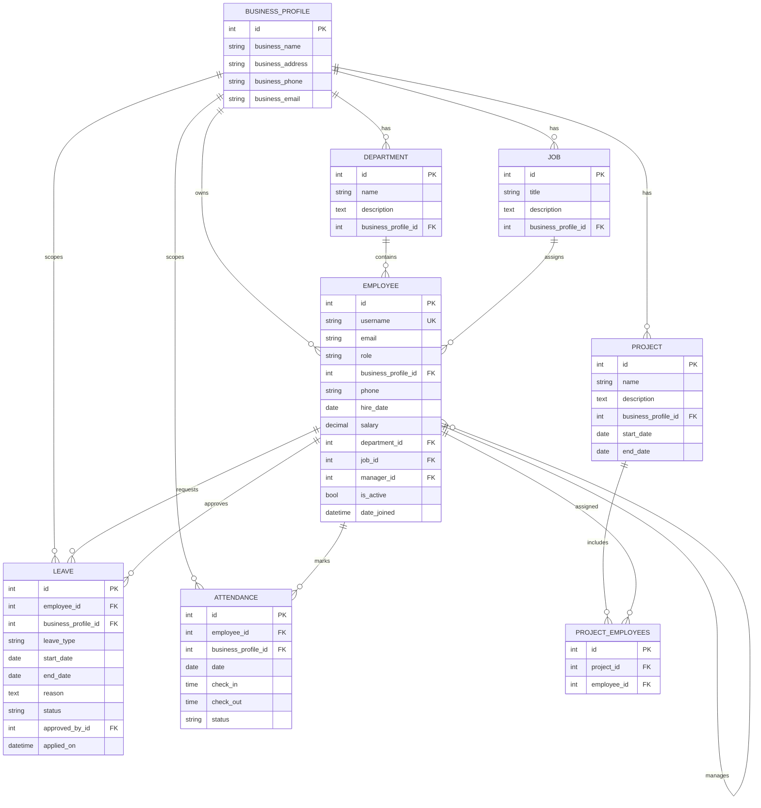

# Database Documentation

This document describes the current relational data model for the Employee Management System, including:

- entity list and table-level purpose
- key columns, constraints, and relationships
- ER diagram (Mermaid)
- example data tables

> Note: This documentation is based on the current Django models and default SQLite backend.

---

## 1) Database Engine and Conventions

- **Engine**: SQLite (`db.sqlite3`) by default.
- **ORM**: Django ORM.
- **Primary keys**: Auto-generated integer `id` fields.
- **FK naming**: Django stores FK columns as `<field_name>_id`.
- **Custom user model**: `Employee.Employee` is configured as `AUTH_USER_MODEL`.

---

## 2) Entity Overview

### Core ownership entity
- `BusinessProfile`: top-level business boundary. Most operational entities point to this table.

### Identity and organization
- `Employee`: custom auth user, linked to one business; optionally linked to department/job/manager.
- `Department`: department master under a business.
- `Job`: role/job-title master under a business.

### Operations
- `Project`: project under a business.
- `Project_employees` (auto-generated M2M join): maps projects to assigned employees.
- `Leave`: employee leave request and approval status.
- `Attendance`: daily attendance events with optional check-in/check-out.

---

## 3) ER Diagram



---

## 4) Table-by-Table Details

## `Employee_businessprofile`
**Purpose**: Stores business-level identity and parent scope for all business-owned data.

| Column | Type | Null | Key | Notes |
|---|---|---|---|---|
| id | INTEGER | No | PK | Auto increment |
| business_name | VARCHAR(100) | No |  | Business name |
| business_address | VARCHAR(255) | No |  | Address |
| business_phone | VARCHAR(15) | No |  | Contact number |
| business_email | VARCHAR | No |  | Email |

---

## `Employee_employee`
**Purpose**: Custom authentication user and employee profile.

| Column | Type | Null | Key | Notes |
|---|---|---|---|---|
| id | INTEGER | No | PK | Auto increment |
| username | VARCHAR(150) | No | Unique | Login username |
| email | VARCHAR(254) | Yes | Index | Email |
| role | VARCHAR(10) | No |  | `owner` / `employee` |
| business_profile_id | INTEGER | Yes | FK | -> `Employee_businessprofile.id` |
| phone | VARCHAR(15) | Yes |  | Contact number |
| hire_date | DATE | No |  | Defaults to current date |
| salary | DECIMAL(10,2) | Yes |  | Nullable |
| department_id | INTEGER | Yes | FK | -> `Department_department.id` |
| job_id | INTEGER | Yes | FK | -> `Role_job.id` |
| manager_id | INTEGER | Yes | FK | Self-reference -> `Employee_employee.id` |
| is_active | BOOLEAN | No |  | Django auth field |
| date_joined | DATETIME | No |  | Django auth field |

---

## `Department_department`
**Purpose**: Department master for a business.

| Column | Type | Null | Key | Notes |
|---|---|---|---|---|
| id | INTEGER | No | PK | Auto increment |
| name | VARCHAR(100) | No |  | Department name |
| description | TEXT | Yes |  | Optional description |
| business_profile_id | INTEGER | No | FK | -> `Employee_businessprofile.id` |

---

## `Role_job`
**Purpose**: Job title / role master for a business.

| Column | Type | Null | Key | Notes |
|---|---|---|---|---|
| id | INTEGER | No | PK | Auto increment |
| title | VARCHAR(100) | No |  | Role title |
| description | TEXT | Yes |  | Optional description |
| business_profile_id | INTEGER | No | FK | -> `Employee_businessprofile.id` |

---

## `Project_project`
**Purpose**: Stores project metadata and business ownership.

| Column | Type | Null | Key | Notes |
|---|---|---|---|---|
| id | INTEGER | No | PK | Auto increment |
| name | VARCHAR(100) | No |  | Project name |
| description | TEXT | Yes |  | Optional |
| business_profile_id | INTEGER | No | FK | -> `Employee_businessprofile.id` |
| start_date | DATE | No |  | Project start |
| end_date | DATE | Yes |  | Optional end |

---

## `Project_project_employees`
**Purpose**: Many-to-many join table between projects and employees.

| Column | Type | Null | Key | Notes |
|---|---|---|---|---|
| id | INTEGER | No | PK | Auto increment |
| project_id | INTEGER | No | FK | -> `Project_project.id` |
| employee_id | INTEGER | No | FK | -> `Employee_employee.id` |

Typically contains a composite unique constraint on (`project_id`, `employee_id`) generated by Django.

---

## `Leave_leave`
**Purpose**: Leave request lifecycle.

| Column | Type | Null | Key | Notes |
|---|---|---|---|---|
| id | INTEGER | No | PK | Auto increment |
| employee_id | INTEGER | No | FK | -> `Employee_employee.id` |
| business_profile_id | INTEGER | No | FK | -> `Employee_businessprofile.id` |
| leave_type | VARCHAR(10) | No |  | `casual/sick/paid/unpaid` |
| start_date | DATE | No |  | Leave start |
| end_date | DATE | No |  | Leave end |
| reason | TEXT | No |  | Request reason |
| status | VARCHAR(10) | No |  | `pending/approved/rejected` |
| approved_by_id | INTEGER | Yes | FK | -> `Employee_employee.id` |
| applied_on | DATETIME | No |  | Auto timestamp |

Model validation enforces date and business consistency checks.

---

## `Attendance_attendance`
**Purpose**: Daily attendance tracking.

| Column | Type | Null | Key | Notes |
|---|---|---|---|---|
| id | INTEGER | No | PK | Auto increment |
| employee_id | INTEGER | No | FK | -> `Employee_employee.id` |
| business_profile_id | INTEGER | Yes | FK | -> `Employee_businessprofile.id` |
| date | DATE | No |  | Attendance date |
| check_in | TIME | Yes |  | Optional |
| check_out | TIME | Yes |  | Optional |
| status | VARCHAR(10) | No |  | `present/absent/half_day` |

Constraints:
- unique per employee per date (`employee_id`, `date`)
- validation prevents `check_out < check_in`

---

## 5) Relationship Rules (Business Scope)

Business-level consistency is central to this schema:

- Departments/Jobs/Projects/Leaves/Attendance are linked to a `BusinessProfile`.
- Employees are linked to a `BusinessProfile`.
- Leave and attendance validations ensure employee and record business match.
- Dashboard services query data with `request.user.business_profile` filters.

---

## 6) Example Data Tables

Below are realistic sample rows (illustrative only).

### Example: `Employee_businessprofile`

| id | business_name | business_address | business_phone | business_email |
|---:|---|---|---|---|
| 1 | Nova Tech Pvt Ltd | Pune, Maharashtra | +91-9876500001 | admin@novatech.com |

### Example: `Department_department`

| id | name | description | business_profile_id |
|---:|---|---|---:|
| 1 | Engineering | Product and backend engineering | 1 |
| 2 | Human Resources | Hiring and employee operations | 1 |

### Example: `Role_job`

| id | title | description | business_profile_id |
|---:|---|---|---:|
| 1 | Backend Developer | Builds APIs and core services | 1 |
| 2 | HR Executive | Handles hiring workflow | 1 |

### Example: `Employee_employee`

| id | username | email | role | business_profile_id | department_id | job_id | manager_id | is_active |
|---:|---|---|---|---:|---:|---:|---:|---|
| 1 | owner_nova | owner@novatech.com | owner | 1 | NULL | NULL | NULL | 1 |
| 2 | anjali@novatech.com | anjali@novatech.com | employee | 1 | 1 | 1 | 1 | 1 |
| 3 | ravi@novatech.com | ravi@novatech.com | employee | 1 | 2 | 2 | 1 | 1 |

### Example: `Project_project`

| id | name | description | business_profile_id | start_date | end_date |
|---:|---|---|---:|---|---|
| 1 | Payroll Automation | Leave & salary process automation | 1 | 2026-01-01 | NULL |

### Example: `Project_project_employees`

| id | project_id | employee_id |
|---:|---:|---:|
| 1 | 1 | 2 |
| 2 | 1 | 3 |

### Example: `Leave_leave`

| id | employee_id | business_profile_id | leave_type | start_date | end_date | reason | status | approved_by_id |
|---:|---:|---:|---|---|---|---|---|---:|
| 1 | 2 | 1 | casual | 2026-02-10 | 2026-02-11 | Family event | approved | 1 |
| 2 | 3 | 1 | sick | 2026-02-12 | 2026-02-12 | Fever | pending | NULL |

### Example: `Attendance_attendance`

| id | employee_id | business_profile_id | date | check_in | check_out | status |
|---:|---:|---:|---|---|---|---|
| 1 | 2 | 1 | 2026-02-10 | 09:20:00 | 18:05:00 | present |
| 2 | 3 | 1 | 2026-02-10 | NULL | NULL | absent |

---

## 7) Suggested SQL Queries (Examples)

### Active employees per business
```sql
SELECT e.id, e.username, e.email, d.name AS department, j.title AS job_title
FROM Employee_employee e
LEFT JOIN Department_department d ON d.id = e.department_id
LEFT JOIN Role_job j ON j.id = e.job_id
WHERE e.business_profile_id = 1
  AND e.role = 'employee'
  AND e.is_active = 1;
```

### Pending leave requests
```sql
SELECT l.id, e.username, l.leave_type, l.start_date, l.end_date
FROM Leave_leave l
JOIN Employee_employee e ON e.id = l.employee_id
WHERE l.business_profile_id = 1
  AND l.status = 'pending'
ORDER BY l.applied_on DESC;
```

### Today attendance summary
```sql
SELECT a.status, COUNT(*) AS total
FROM Attendance_attendance a
WHERE a.business_profile_id = 1
  AND a.date = DATE('now')
GROUP BY a.status;
```

---

## 8) Future Improvements

- Add explicit DB-level `CHECK` constraints for enum fields where supported.
- Add indexes for high-traffic filters (`business_profile_id`, `status`, `date`).
- Add soft-delete strategy for audit-friendly history.
- Add migration docs whenever schema changes are made.
