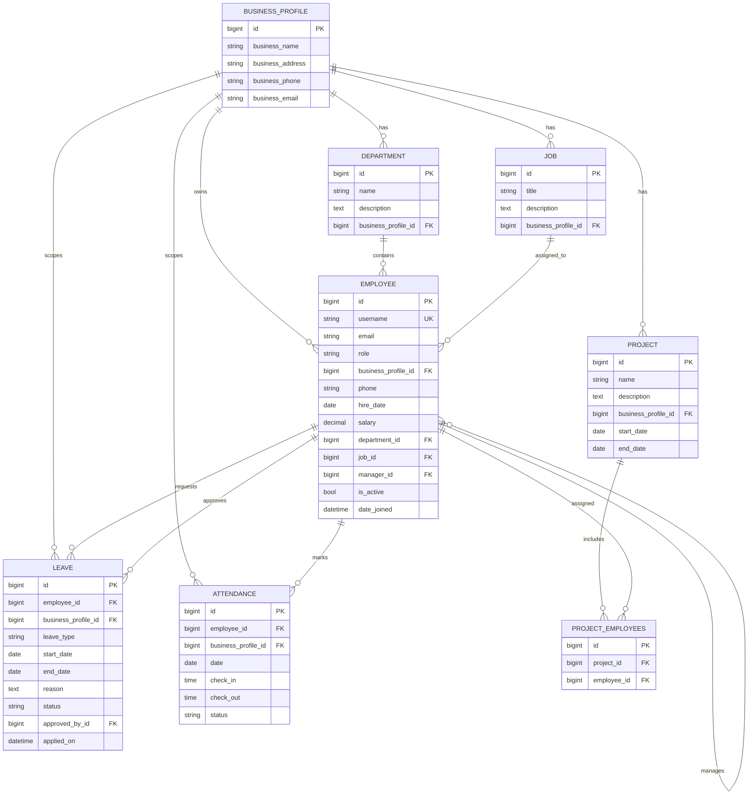

# Entity Relationship Diagram (Models Database)

This ER diagram represents the current Django models and relationships across apps:
- `Employee` (custom auth model)
- `BusinessProfile`
- `Department`
- `Job`
- `Project`
- `Leave`
- `Attendance`
- Project–Employee many-to-many join

---

## ER Diagram (Mermaid)

---

## Notes

- `Employee` is the active `AUTH_USER_MODEL`.
- `Attendance` has unique constraint on (`employee`, `date`).
- `Project_EMPLOYEES` is the auto-generated join table for `Project.employees` many-to-many field.
- `Leave.approved_by` and `Employee.manager` are self/employee references.
