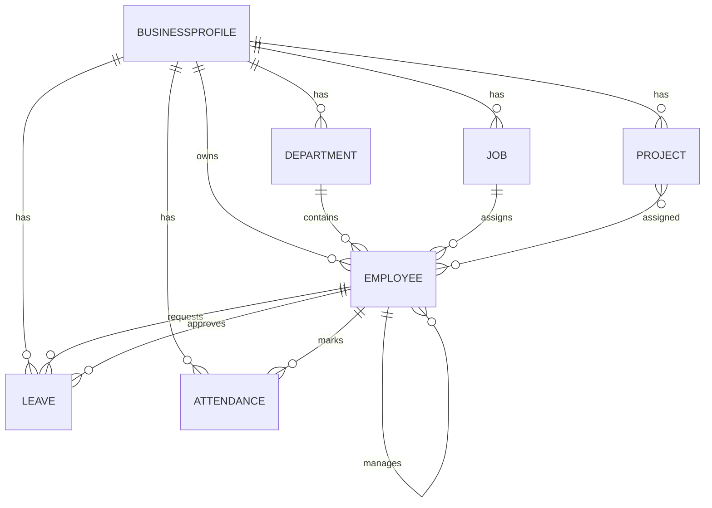

# Models Documentation (All Apps)

This document contains model-level documentation for all `models.py` files in the repository, including fields, relationships, constraints, and helper methods.

## Files Covered
- `Employee/models.py`: 2 model(s)
- `Department/models.py`: 1 model(s)
- `Role/models.py`: 1 model(s)
- `Project/models.py`: 1 model(s)
- `Leave/models.py`: 1 model(s)
- `Attendance/models.py`: 1 model(s)
- `Dashboard/models.py`: 0 model(s)
- `Login_App/models.py`: 0 model(s)

## Model Relationship Diagram (ER)



---

## File: `Employee/models.py`

### Model: `BusinessProfile`
- **Base classes**: `models.Model`
- **Source location**: `Employee/models.py:7-14`

#### Fields
| Field | Type | Key options |
|---|---|---|
| `business_name` | `CharField` | max_length=100 |
| `business_address` | `CharField` | max_length=255 |
| `business_phone` | `CharField` | max_length=15 |
| `business_email` | `EmailField` | - |

#### Meta options
_No Meta options defined._

#### Methods
- `__str__()` (`Employee/models.py:13-14`)

#### Source snippet
```python
class BusinessProfile(models.Model):
    business_name = models.CharField(max_length=100)
    business_address = models.CharField(max_length=255)
    business_phone = models.CharField(max_length=15)
    business_email = models.EmailField()

    def __str__(self):
        return self.business_name
```

### Model: `Employee`
- **Base classes**: `AbstractUser`
- **Source location**: `Employee/models.py:16-67`

#### Fields
| Field | Type | Key options |
|---|---|---|
| `role` | `CharField` | max_length=10; default='employee'; choices=ROLE_CHOICES |
| `business_profile` | `ForeignKey` | null=True; blank=True; on_delete=models.CASCADE; related_name='employees'; args=BusinessProfile |
| `phone` | `CharField` | max_length=15; blank=True |
| `hire_date` | `DateField` | default=now |
| `salary` | `DecimalField` | null=True; blank=True |
| `department` | `ForeignKey` | null=True; blank=True; on_delete=models.SET_NULL; related_name='employees'; args=Department |
| `job` | `ForeignKey` | null=True; blank=True; on_delete=models.SET_NULL; related_name='employees'; args=Job |
| `manager` | `ForeignKey` | null=True; blank=True; on_delete=models.SET_NULL; related_name='team_members'; args='self' |

#### Meta options
_No Meta options defined._

#### Methods
- `__str__()` (`Employee/models.py:66-67`)

#### Source snippet
```python
class Employee(AbstractUser):
    ROLE_CHOICES = (
        ('employee', 'Employee'),
        ('owner', 'Owner'),
    )

    role = models.CharField(max_length=10, choices=ROLE_CHOICES, default='employee')

    business_profile = models.ForeignKey(
        BusinessProfile,
        null= True,
        blank= True,
        on_delete=models.CASCADE,
        related_name='employees'
    )

    phone = models.CharField(max_length=15, blank=True)
    hire_date = models.DateField(default=now)

    salary = models.DecimalField(
        max_digits=10,
        decimal_places=2,
        null=True,
        blank=True
    )

    department = models.ForeignKey(
        Department,
        on_delete=models.SET_NULL,
        null=True,
        blank=True,
        related_name='employees'
    )

    job = models.ForeignKey(
        Job,
        on_delete=models.SET_NULL,
        null=True,
        blank=True,
        related_name='employees'
    )

    manager = models.ForeignKey(
        'self',
        on_delete=models.SET_NULL,
        null=True,
        blank=True,
        related_name='team_members'
    )

    def __str__(self):
        return self.username
```

---

## File: `Department/models.py`

### Model: `Department`
- **Base classes**: `models.Model`
- **Source location**: `Department/models.py:4-17`

#### Fields
| Field | Type | Key options |
|---|---|---|
| `name` | `CharField` | max_length=100 |
| `description` | `TextField` | blank=True |
| `business_profile` | `ForeignKey` | on_delete=models.CASCADE; related_name='departments'; args='Employee.BusinessProfile' |

#### Meta options
_No Meta options defined._

#### Methods
- `total_employees()` (`Department/models.py:13-14`)
- `__str__()` (`Department/models.py:16-17`)

#### Source snippet
```python
class Department(models.Model):
    name = models.CharField(max_length=100)
    description = models.TextField(blank=True)

    business_profile = models.ForeignKey(
        'Employee.BusinessProfile',
        on_delete=models.CASCADE,
        related_name='departments'
    )
    def total_employees(self):
        return self.employees.count()
    
    def __str__(self):
        return self.name
```

---

## File: `Role/models.py`

### Model: `Job`
- **Base classes**: `models.Model`
- **Source location**: `Role/models.py:2-11`

#### Fields
| Field | Type | Key options |
|---|---|---|
| `title` | `CharField` | max_length=100 |
| `description` | `TextField` | blank=True |
| `business_profile` | `ForeignKey` | on_delete=models.CASCADE; related_name='jobs'; args='Employee.BusinessProfile' |

#### Meta options
_No Meta options defined._

#### Methods
- `__str__()` (`Role/models.py:10-11`)

#### Source snippet
```python
class Job(models.Model):
    title = models.CharField(max_length=100)
    description = models.TextField(blank=True)
    business_profile = models.ForeignKey(
        'Employee.BusinessProfile',
        on_delete=models.CASCADE,
        related_name='jobs'
    )
    def __str__(self):
        return self.title
```

---

## File: `Project/models.py`

### Model: `Project`
- **Base classes**: `models.Model`
- **Source location**: `Project/models.py:3-23`

#### Fields
| Field | Type | Key options |
|---|---|---|
| `name` | `CharField` | max_length=100 |
| `description` | `TextField` | blank=True |
| `business_profile` | `ForeignKey` | on_delete=models.CASCADE; related_name='projects'; args='Employee.BusinessProfile' |
| `employees` | `ManyToManyField` | blank=True; related_name='projects'; args=Employee |
| `start_date` | `DateField` | - |
| `end_date` | `DateField` | null=True; blank=True |

#### Meta options
_No Meta options defined._

#### Methods
- `__str__()` (`Project/models.py:22-23`)

#### Source snippet
```python
class Project(models.Model):
    name = models.CharField(max_length=100)
    description = models.TextField(blank=True)

    business_profile = models.ForeignKey(
       'Employee.BusinessProfile',
        on_delete=models.CASCADE,
        related_name='projects'
    )

    employees = models.ManyToManyField(
        Employee,
        related_name='projects',
        blank=True
    )

    start_date = models.DateField()
    end_date = models.DateField(null=True, blank=True)

    def __str__(self):
        return self.name
```

---

## File: `Leave/models.py`

### Model: `Leave`
- **Base classes**: `models.Model`
- **Source location**: `Leave/models.py:4-65`

#### Fields
| Field | Type | Key options |
|---|---|---|
| `employee` | `ForeignKey` | on_delete=models.CASCADE; related_name='leaves'; args=Employee |
| `business_profile` | `ForeignKey` | on_delete=models.CASCADE; related_name='leaves'; args='Employee.BusinessProfile' |
| `leave_type` | `CharField` | max_length=10; choices=LEAVE_TYPE |
| `start_date` | `DateField` | - |
| `end_date` | `DateField` | - |
| `reason` | `TextField` | - |
| `status` | `CharField` | max_length=10; default='pending'; choices=LEAVE_STATUS |
| `approved_by` | `ForeignKey` | null=True; blank=True; on_delete=models.SET_NULL; related_name='approved_leaves'; args='Employee.Employee' |
| `applied_on` | `DateTimeField` | - |

#### Meta options
_No Meta options defined._

#### Methods
- `clean()` (`Leave/models.py:55-62`)
- `__str__()` (`Leave/models.py:64-65`)

#### Source snippet
```python
class Leave(models.Model):
    LEAVE_STATUS = (
        ('pending', 'Pending'),
        ('approved', 'Approved'),
        ('rejected', 'Rejected'),
    )

    LEAVE_TYPE = (
        ('casual', 'Casual'),
        ('sick', 'Sick'),
        ('paid', 'Paid'),
        ('unpaid', 'Unpaid'),
    )

    employee = models.ForeignKey(
        Employee,
        on_delete=models.CASCADE,
        related_name='leaves'
    )

    business_profile = models.ForeignKey(
        'Employee.BusinessProfile',
        on_delete=models.CASCADE,
        related_name='leaves'
    )

    leave_type = models.CharField(
        max_length=10,
        choices=LEAVE_TYPE
    )

    start_date = models.DateField()
    end_date = models.DateField()
    reason = models.TextField()

    status = models.CharField(
        max_length=10,
        choices=LEAVE_STATUS,
        default='pending'
    )

    approved_by = models.ForeignKey(
        'Employee.Employee',
        on_delete=models.SET_NULL,
        null=True,
        blank=True,
        related_name='approved_leaves'
    )

    applied_on = models.DateTimeField(auto_now_add=True)

    def clean(self):
        if self.end_date < self.start_date:
            raise ValidationError("End date cannot be before start date")

        if self.employee.business_profile != self.business_profile:
            raise ValidationError(
                "Employee must belong to the same business as the leave"
            )

    def __str__(self):
        return f"{self.employee.username} ({self.leave_type}) - {self.start_date} to {self.end_date}"
```

---

## File: `Attendance/models.py`

### Model: `Attendance`
- **Base classes**: `models.Model`
- **Source location**: `Attendance/models.py:5-62`

#### Fields
| Field | Type | Key options |
|---|---|---|
| `employee` | `ForeignKey` | on_delete=models.CASCADE; related_name='attendance'; args='Employee.Employee' |
| `business_profile` | `ForeignKey` | null=True; blank=True; on_delete=models.CASCADE; related_name='attendance'; args='Employee.BusinessProfile' |
| `date` | `DateField` | - |
| `check_in` | `TimeField` | null=True; blank=True |
| `check_out` | `TimeField` | null=True; blank=True |
| `status` | `CharField` | max_length=10; default='present'; choices=STATUS_CHOICES |

#### Meta options
- `unique_together` = `('employee', 'date')`
- `ordering` = ``

#### Methods
- `clean()` (`Attendance/models.py:40-49`)
- `save()` (`Attendance/models.py:51-54`)
- `Total_hours()` (`Attendance/models.py:56-60`)
- `__str__()` (`Attendance/models.py:61-62`)

#### Source snippet
```python
class Attendance(models.Model):
    STATUS_CHOICES = (
        ('present', 'Present'),
        ('absent', 'Absent'),
        ('half_day', 'Half Day'),
    )

    employee = models.ForeignKey(
        'Employee.Employee',
        on_delete=models.CASCADE,
        related_name='attendance'
    )

    business_profile = models.ForeignKey(
        'Employee.BusinessProfile',
        on_delete=models.CASCADE,
        related_name='attendance',
        null=True,
        blank=True
    )

    date = models.DateField()
    check_in = models.TimeField(null=True, blank=True)
    check_out = models.TimeField(null=True, blank=True)

    status = models.CharField(
        max_length=10,
        choices=STATUS_CHOICES,
        default='present'
    )

    class Meta:
        unique_together = ('employee', 'date')
        ordering = ['-date']

    def clean(self):
        if self.check_in and self.check_out:
            if self.check_out < self.check_in:
                raise ValidationError("Check-out time cannot be before check-in")

        if self.employee_id and self.business_profile_id:
            if self.employee.business_profile_id != self.business_profile_id:
                raise ValidationError(
                    "Employee must belong to the same business as attendance record"
                )
            
    def save(self, *args, **kwargs):
        if not self.business_profile and self.employee:
            self.business_profile = self.employee.business_profile
        super().save(*args, **kwargs)

    def Total_hours(self):
        if self.check_in and self.check_out:
            delta = datetime.combine(date.min, self.check_out) - datetime.combine(date.min, self.check_in)
            return delta
        return None
    def __str__(self):
        return f"{self.employee.username} - {self.date}"
```

---

## File: `Dashboard/models.py`

_No model classes defined in this file._

---

## File: `Login_App/models.py`

_No model classes defined in this file._
